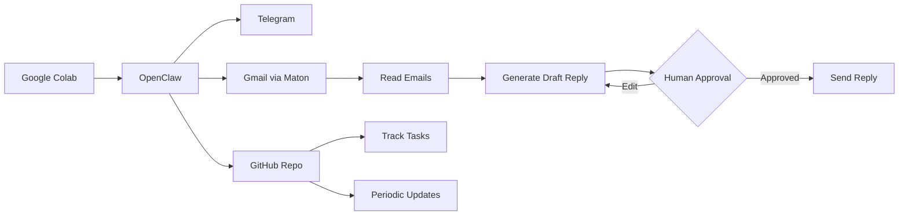
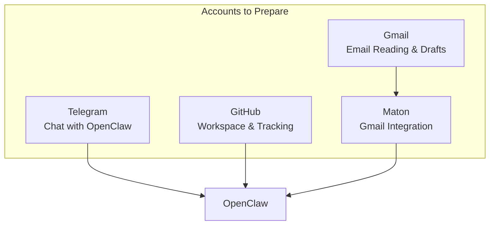
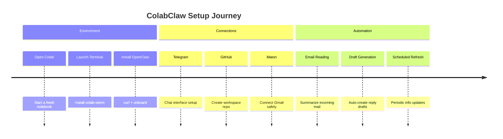
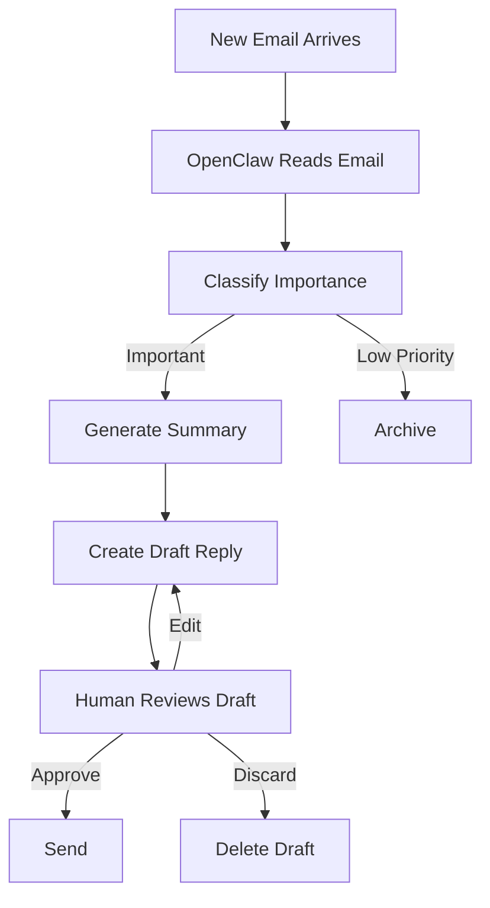

<p align="right">
  <a href="./README.md">English</a> | <a href="./README_ko.md">한국어</a>
</p>

<div align="center">

# 🦀 ColabClaw

### Your Personal AI Automation Workspace on Google Colab

[](https://opensource.org/licenses/MIT)
[](https://colab.research.google.com)
[](https://github.com/openclaw/openclaw)
[](https://telegram.org)
[](https://mail.google.com)
[](https://github.com)
[](https://www.maton.ai)

<br/>

### *"The fastest, easiest way to learn OpenClaw — with a practical email assistant use case!"*

[🚀 Quick Start](#-quick-start) · [📋 Features](#-features) · [🔄 Workflow](#-workflow-overview) · [🛠 Setup](#-full-setup-guide) · [🇰🇷 한국어](./README_ko.md)

<br/>

[](https://github.com/tykimos/colabclaw/stargazers)
[](https://github.com/tykimos/colabclaw/network/members)
[](https://github.com/tykimos/colabclaw/watchers)
[](https://github.com/tykimos/colabclaw/commits/main)

</div>

---

## Why ColabClaw?

Installation issues on OpenClaw's GitHub never stop. Here are real examples:

- **All install methods fail on a clean macOS** — Node v14 PATH shadows newly installed v22, npm throws EACCES permission errors ([#21464](https://github.com/openclaw/openclaw/issues/21464))
- **npm install bricks Raspberry Pi devices** — `@discordjs/opus` lacks ARM64 prebuilds, causing native module build failure ([#23861](https://github.com/openclaw/openclaw/issues/23861))
- **sharp dependency build fails on Apple Silicon** — `node-gyp` unavailable, source build attempt errors out ([#4592](https://github.com/openclaw/openclaw/issues/4592))
- **Can't even update** — `node-llama-cpp` fails to install cmake, leaving users stuck without security patches ([#32025](https://github.com/openclaw/openclaw/issues/32025))

While teaching and learning OpenClaw, we've seen **too many people give up at the installation step**. The tool itself is great, but Node.js version conflicts, native module build failures, and OS-specific compatibility issues block people before they even start.

So we thought — **what if you could run it directly on Google Colab?**

Of course, Colab resets when the session ends, so it's not suitable for always-on production use. But for the **learning phase**, you can experience OpenClaw's core features right away without any installation hassle. No more giving up out of setup fatigue — you can even build a practical email assistant use case hands-on. That's ColabClaw.

---

## 📋 Features

| Feature | Description | Service |
|---------|-------------|---------|
| 🖥️ **Colab Terminal** | Launch a full terminal inside Google Colab | Google Colab |
| 🤖 **OpenClaw Engine** | Install and run OpenClaw as your automation core | OpenClaw |
| 💬 **Chat Interface** | Talk to OpenClaw through Telegram | Telegram |
| 📧 **Email Automation** | Read Gmail, summarize, and draft replies automatically | Gmail + Maton |
| 📁 **GitHub Workspace** | Use a repository as your structured task surface | GitHub |
| 🔄 **Scheduled Refresh** | Periodically collect and update information | Cron / OpenClaw |

---

## 🔄 Workflow Overview



---

## 🚀 Quick Start

### Step 1: Open Google Colab

Start a fresh [Google Colab notebook](https://colab.research.google.com).

### Step 2: Launch Terminal

```python
!pip install colab-xterm
%load_ext colabxterm
%xterm
```

### Step 3: Install OpenClaw

```bash
curl -fsSL https://openclaw.ai/install.sh | bash
openclaw onboard --install-daemon
```

> ✅ That's it! OpenClaw is now running inside your Colab environment.

---

## 🔑 Required Accounts

Before configuring the full workflow, set up these services:



| Service | Purpose | Link |
|---------|---------|------|
| **Telegram** | Communicate with OpenClaw | [telegram.org](https://telegram.org) |
| **GitHub** | Repository-based workflow & tracking | [github.com](https://github.com) |
| **Gmail** | Read emails & generate draft replies | [mail.google.com](https://mail.google.com) |
| **Maton** | Secure Gmail connection | [maton.ai](https://www.maton.ai) |

---

## 🛠 Full Setup Guide



### 📁 GitHub as Your Workspace

Use a GitHub repository to store and manage:

```
📂 your-workspace-repo/
├── 📝 notes/              # Personal notes & memos
├── 📊 collected-info/     # Gathered information
├── 📋 workflows/          # Automation scripts
├── 📈 reports/            # Periodic summaries
└── 🔄 updates/            # Scheduled refresh results
```

### 📧 Email Automation Pipeline

The email workflow follows a **human-in-the-loop** design:



> 💡 **Key Principle:** Draft generation is automated. Actual sending requires human approval.

### 🔄 Periodic Refresh

Schedule recurring tasks to keep your workspace updated:

- 📊 Repository status checks
- 📋 Scheduled report summaries
- 📧 Email-related update monitoring
- 🔁 Recurring task result collection
- 📡 Lightweight monitoring outputs

---

---

## 📍 Roadmap

- [x] Repository setup
- [x] Basic README & documentation
- [x] Email → Issue workflow design
- [ ] Full Colab setup tutorial with screenshots
- [ ] Gmail + Maton integration guide
- [ ] Telegram connection walkthrough
- [ ] GitHub workflow examples
- [ ] Draft reply generation examples
- [ ] Scheduled refresh automation examples
- [ ] Colab limitations & best practices

---

## 🔗 Related Links

| Resource | Link |
|----------|------|
| 🤖 OpenClaw | [github.com/openclaw/openclaw](https://github.com/openclaw/openclaw) |
| 📖 OpenClaw Docs | [docs.openclaw.ai](https://docs.openclaw.ai) |
| 🔗 Maton | [maton.ai](https://www.maton.ai) |
| 💬 Telegram | [telegram.org](https://telegram.org) |
| 📁 GitHub | [github.com](https://github.com) |
| 📧 Gmail | [mail.google.com](https://mail.google.com) |

---

## ⭐ Star History

[](https://star-history.com/#tykimos/colabclaw&Date)

---

## 🤝 Contributing

Contributions are welcome! Feel free to:

- ⭐ Star this repository
- 🐛 Open an [Issue](https://github.com/tykimos/colabclaw/issues)
- 🔀 Submit a [Pull Request](https://github.com/tykimos/colabclaw/pulls)

---

## 📊 Activity

[](https://github.com/tykimos/colabclaw/commits/main)
[](https://github.com/tykimos/colabclaw/issues)
[](https://github.com/tykimos/colabclaw/pulls)
[](https://github.com/tykimos/colabclaw)

---

## 📜 License

This project is licensed under the MIT License.

[](https://opensource.org/licenses/MIT)

---

<div align="center">

**Made with ❤️ for the AI automation community**

[](https://visitorbadge.io/status?path=tykimos%2Fcolabclaw)

</div>
