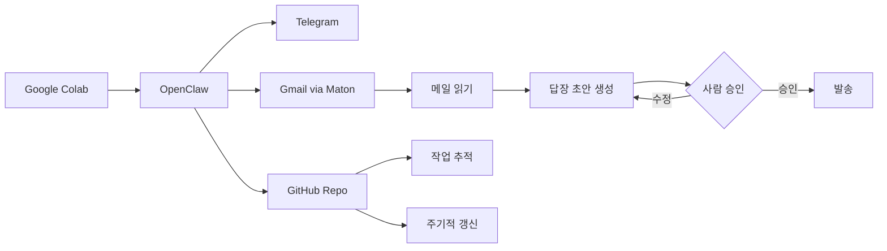
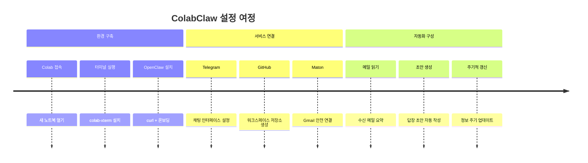
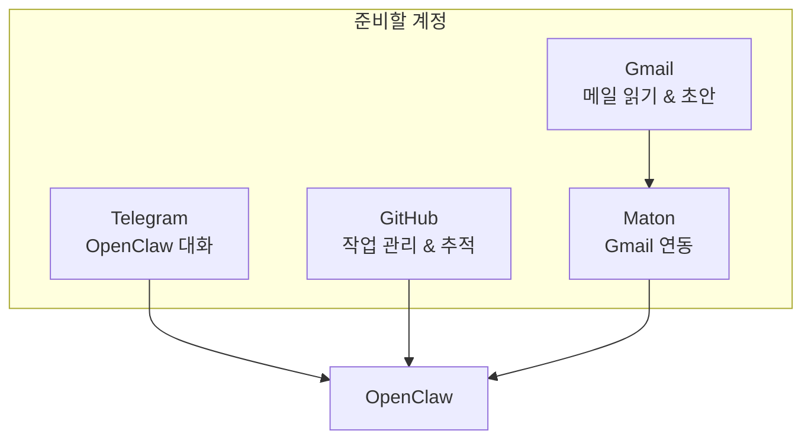
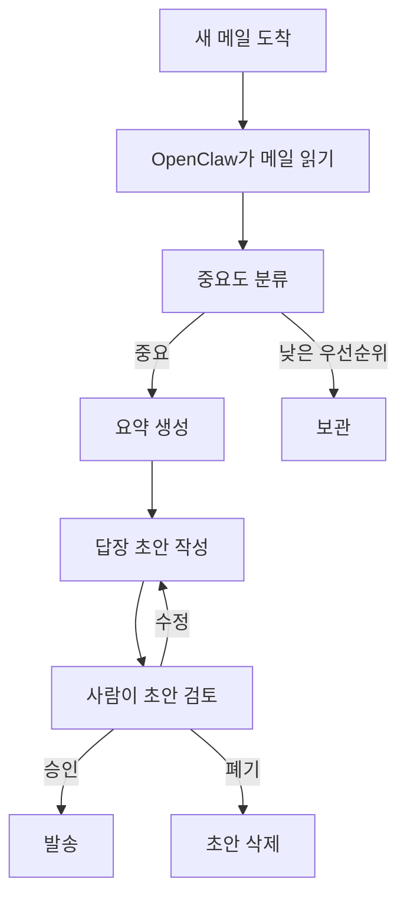

<p align="right">
  <a href="./README.md">English</a> | <a href="./README_ko.md">한국어</a>
</p>

<div align="center">

# 🦀 ColabClaw

### Google Colab 위에서 만드는 나만의 AI 자동화 워크스페이스

[](https://opensource.org/licenses/MIT)
[](https://colab.research.google.com)
[](https://github.com/openclaw/openclaw)
[](https://telegram.org)
[](https://mail.google.com)
[](https://github.com)
[](https://www.maton.ai)

<br/>

### *"오픈클로를 가장 빨리 편하게 배우는 방법! 이메일 비서 실용사례까지"*

[🚀 빠른 시작](#-빠른-시작) · [📋 기능](#-기능) · [🔄 워크플로](#-워크플로-개요) · [🛠 설정 가이드](#-전체-설정-가이드) · [🇺🇸 English](./README.md)

<br/>

[](https://github.com/tykimos/colabclaw/stargazers)
[](https://github.com/tykimos/colabclaw/network/members)
[](https://github.com/tykimos/colabclaw/watchers)
[](https://github.com/tykimos/colabclaw/commits/main)

</div>

---

## 왜 ColabClaw를 만들었나요?

오픈클로(OpenClaw) GitHub에는 설치 관련 이슈가 끊이지 않습니다. 실제 사례를 보면:

- **macOS 클린 설치에서 모든 방법 실패** — Node v14 PATH가 새로 설치한 v22를 가리고, npm은 EACCES 권한 오류 발생 ([#21464](https://github.com/openclaw/openclaw/issues/21464))
- **Raspberry Pi에서 npm install이 기기를 망가뜨림** — `@discordjs/opus`에 ARM64 프리빌드가 없어 네이티브 모듈 빌드 실패 ([#23861](https://github.com/openclaw/openclaw/issues/23861))
- **Apple Silicon에서 sharp 의존성 빌드 실패** — `node-gyp`가 없어 소스 빌드 시도 후 에러 ([#4592](https://github.com/openclaw/openclaw/issues/4592))
- **업데이트조차 불가** — `node-llama-cpp`가 cmake를 설치하려다 실패, 보안 패치도 못 받는 상황 ([#32025](https://github.com/openclaw/openclaw/issues/32025))

오픈클로를 가르치고 배우는 과정에서 **설치 단계에서 지쳐 포기하는 분들**을 많이 봤습니다. 도구 자체는 훌륭한데, Node.js 버전 충돌, 네이티브 모듈 빌드 실패, OS별 호환성 문제로 시작하기 전에 막혀버리는 거죠.

그래서 생각했습니다 — **Google Colab에서 바로 실행할 수 있다면?**

물론 Colab은 세션이 끊기면 환경이 초기화되기 때문에 상시 운영용으로는 적합하지 않습니다. 하지만 **배우고 익히는 단계**에서만큼은 설치 걱정 없이 오픈클로의 핵심 기능을 바로 체험할 수 있습니다. 설치에 지쳐 포기하는 일 없이, 이메일 비서 같은 실용적인 사례까지 직접 만들어볼 수 있는 환경 — 그것이 ColabClaw입니다.

---

## 📋 기능

| 기능 | 설명 | 서비스 |
|------|------|--------|
| 🖥️ **Colab 터미널** | Google Colab 안에서 터미널 실행 | Google Colab |
| 🤖 **OpenClaw 엔진** | 자동화 핵심 엔진 설치 및 실행 | OpenClaw |
| 💬 **채팅 인터페이스** | Telegram으로 OpenClaw와 대화 | Telegram |
| 📧 **이메일 자동화** | Gmail 읽기, 요약, 답장 초안 자동 생성 | Gmail + Maton |
| 📁 **GitHub 워크스페이스** | 저장소를 구조화된 작업 공간으로 활용 | GitHub |
| 🔄 **주기적 갱신** | 정보를 주기적으로 수집하고 업데이트 | Cron / OpenClaw |

---

## 🔄 워크플로 개요


---
## 🛠 전체 설정 가이드


---

## 🚀 빠른 시작

### Step 0: 필요한 계정 준비

전체 워크플로를 구성하기 전에 아래 서비스를 준비하세요:



| 서비스 | 용도 | 링크 |
|--------|------|------|
| **Telegram** | OpenClaw와 소통 | [telegram.org](https://telegram.org) |
| **GitHub** | 저장소 기반 작업 관리 | [github.com](https://github.com) |
| **Gmail** | 메일 읽기 & 답장 초안 생성 | [mail.google.com](https://mail.google.com) |
| **Maton** | 안전한 Gmail 연결 | [maton.ai](https://www.maton.ai) |

### Step 1: Google Colab 접속

[Google Colab](https://colab.research.google.com)에서 새 노트북을 엽니다.

### Step 2: 터미널 실행

아래 페이지에서 하단에 터미널 부분을 클릭합니다.


### Step 3: OpenClaw 설치

```bash
curl -fsSL https://openclaw.ai/install.sh | bash
```


설치가 완료되면 아래와 같이 질문이 나오는 데, 보기에 따라해주시면 됩니다. 

```
◇  I understand this is personal-by-default and shared/multi-user use requires lock-down. Continue?
│  Yes
◇  Setup mode
│  QuickStart
◇  Model/auth provider
│  OpenAI
◇  OpenAI auth method
│  OpenAI Codex (ChatGPT OAuth)
◇  Paste the authorization code (or full redirect URL):
│  http://localhost:1455/auth/callback?code=oaistb_ac_1SZn995Ut-nebUP1hVMc&scope=openid+profile+email+offline_access&state=653d71043b52
◇  Default model
│  Keep current (openai-codex/gpt-5.4)
◇  Select channel (QuickStart)
│  Telegram (Bot API)
◇  How do you want to provide this Telegram bot token?
│  Enter Telegram bot token
◇  Search provider
│  DuckDuckGo Search (experimental)
◇  OpenAI auth method
│  OpenAI Codex (ChatGPT OAuth)
◇  Configure skills now? (recommended)
│  Yes
◇  Enable hooks?
│  Skip for now
```

설정을 완료했다면 아래 명령어로 실행합니다.

```bash
openclaw gateway run --verbose
```
---

### 텔레그램 연동

텔레그램에서 해당봇을 클릭한 뒤 /start 메시지를 보내면 아래와 같은 메시지를 받으실 수 있습니다. 

OpenClaw: access not configured.
Your Telegram user id: 6XXX169904
Pairing code: T72W8XXX
Ask the bot owner to approve with:
openclaw pairing approve telegram T72W8XXX

그럼 다시 터미널로 돌아가서 Ctrl+c로 실행을 종료한 뒤 아래 명령어를 입력합니다. 

```bash
openclaw pairing approve telegram T72W8XXX
```

페어링이 완료되었다는 메시지가 뜨면 다시 오픈클로를 실행시킵니다. 

```bash
openclaw gateway run --verbose
```

그 다음 텔레그램을 통해서 인사를 하면 서로 어떻게 불러주면 좋을 지 스스로를 어떻게 정의할 지 등을 물어보면 원하시는 대로 답을 하면 된다.

### 📁 GitHub를 워크스페이스로 활용

GitHub 저장소에 다음과 같은 것들을 저장하고 관리합니다:

```
📂 your-workspace-repo/
├── 📝 notes/              # 개인 메모
├── 📊 collected-info/     # 수집된 정보
├── 📋 workflows/          # 자동화 스크립트
├── 📈 reports/            # 정기 요약 리포트
└── 🔄 updates/            # 주기적 갱신 결과
```

### 📧 이메일 자동화 파이프라인

이메일 워크플로는 **사람이 포함된(Human-in-the-loop)** 설계를 따릅니다:



> 💡 **핵심 원칙:** 초안 생성은 자동화, 실제 발송은 반드시 사람이 승인한 후에만!

Gmail + Maton 조합으로 이메일을 연결하고 싶다고 말하고, Maton API Key를 Maton 페이지에서 할당 받은 뒤 아래 명령을 터미널에서 실행시킨다. 기존에 구동 중인 OpenClaw가 있다면 종료했다가 아래 명령 실행 후 다시 실행시킨다.

```bash
export MATON_API_KEY='XXXXXXX'
```

### 🔄 주기적 갱신

반복 작업을 스케줄링하여 워크스페이스를 최신 상태로 유지합니다:

- 📊 저장소 상태 확인
- 📋 정기 리포트 요약
- 📧 이메일 관련 업데이트 모니터링
- 🔁 반복 작업 결과 수집
- 📡 가벼운 모니터링 출력 저장

---

## 🔗 관련 링크

| 리소스 | 링크 |
|--------|------|
| 🤖 OpenClaw | [github.com/openclaw/openclaw](https://github.com/openclaw/openclaw) |
| 📖 OpenClaw 문서 | [docs.openclaw.ai](https://docs.openclaw.ai) |
| 🔗 Maton | [maton.ai](https://www.maton.ai) |
| 💬 Telegram | [telegram.org](https://telegram.org) |
| 📁 GitHub | [github.com](https://github.com) |
| 📧 Gmail | [mail.google.com](https://mail.google.com) |

---

## ⭐ Star History

[](https://star-history.com/#tykimos/colabclaw&Date)

---

## 🤝 기여하기

기여를 환영합니다! 다음 방법으로 참여해 주세요:

- ⭐ 이 저장소에 스타 남기기
- 🐛 [이슈](https://github.com/tykimos/colabclaw/issues) 열기
- 🔀 [풀 리퀘스트](https://github.com/tykimos/colabclaw/pulls) 제출하기

---

## 📊 활동

[](https://github.com/tykimos/colabclaw/commits/main)
[](https://github.com/tykimos/colabclaw/issues)
[](https://github.com/tykimos/colabclaw/pulls)
[](https://github.com/tykimos/colabclaw)

---

## 📜 라이선스

이 프로젝트는 MIT 라이선스를 따릅니다.

[](https://opensource.org/licenses/MIT)

---

<div align="center">

**AI 자동화 커뮤니티를 위해 ❤️으로 만들었습니다**

[](https://visitorbadge.io/status?path=tykimos%2Fcolabclaw)

</div>
